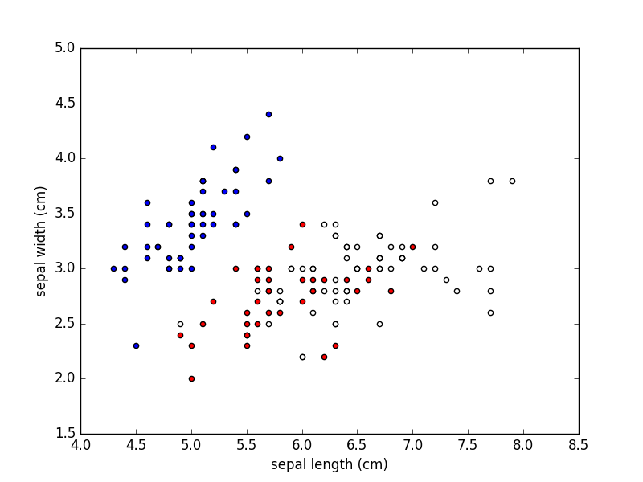
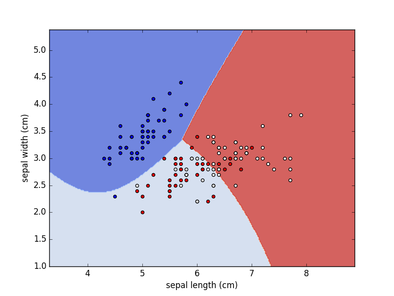

> First steps, the workflow, supervised learning & classification

This is the first blog about **Machine Learning**. By this point everybody has aat least some understandig of what is machine learning so we are going to skip the part where what is it and what's useful for.

We will talk about Deep Learning too 😏.

## Where to start?

**Algorithms**. We need to get comfortable with how the algorithms that are already out there work. At least with some of them and understand when is better to use one or other depending on the problem we need to solve.

We are not going to program those algorithms ourselves. We are going to use python and different opensource libraries to apply those algorithms directly and observe them in action. We are going to try to understand the magic underneath.

These algorithms are also called **models**. **A model represents a compelx reality in a simpler way**. The problem is that any representation wont't be perfect and there will always going to be an **error**. Our job will be to maximize the precision with which that model is able to classify, predict or describe that reality 🤔.

The easiest and most common way to get started is with an iPython notebook. That way we can start playing with some machine learning libraries and algorithms right away. 

The fastest way to get an iPython notebook up and runnign is using a [docker](https://www.docker.com) 🐳 image. After installing docker just run the following command in your working repository:

```
docker run -p 8888:8888 -v $(pwd):/src stanete/scikit-learn
```

This will download the docker image and will run a container with everything you need. It will show you a console message containing a URL that you will have to copy and paste on your browser. Just like magic ✨.

<div class="divider"></div>

## The workflow

Almost any machine learning problem will follow the same workflow. We will talk about it with more detail in future posts. But for now here is a simplified version of it:

1. Gathering and preparing the data
2. Choosing a model
3. Training the model
4. Testing the model

<div class="divider"></div>

## Gathering and preparing the data

Es improbable (no imposible) que nosotros desarrollemos un nuevo algoritmo que de mejores resultados que los que ya existen. Pero un algoritmo sin datos no sirve de nada. Un algoritmo puede dar resultados muy diferentes dependiendo de la estructura de los datos con los que lo alimentamos. Por eso gran parte de nuestro trabajo será recolectar y manipular datos. A esto se le llama *feature engineering*. Una feature o **característica** es cualquier medida de nuestros datos.

Para empezar vamos a usar el dataset de las flores Iris, un conjunto de datos clásico de los años treinta que contiene características sobre 3 subespecies de flores Iris:


 Hoy en día, las diferentes especies de Iris se clasificarían por sus firmas genómicas pero en la década de 1930, el ADN no había sido identificado como el portador de la información genética, pero sí que se las podían clasificar por su morfología:

- Longitud del sépalo (sepal length (cm))
- Anchura del sépalo (sepal width (cm))
- Longitud de los pétalos (petal length (cm))
- Anchura de los pétalos (petal width (cm))

### Cargar datos

Lo bueno es que este dataset viene dentro de *scikit-learn*:

```python
from sklearn import datasets

iris = datasets.load_iris()
```

Para simplificarlo al máximo, vamos a trabajar solamente con las primeras dos características:

```python
features = iris.data[:, :2]

feature_names = iris.feature_names[:2]

print(feature_names)

# ['sepal length (cm)', 'sepal width (cm)']
```

Los datos de este dataset están etiquetados (labeled). Eso quiere decir que cada conjunto de características corresponde a una subespecie de Iris:

``` python
labels = iris.target

labels_names = iris.target_names

print(labels_names)

# ['setosa' 'versicolor' 'virginica']
```

### Visualizar datos

Vamos a visualizar estos datos con *matplotlib*. Representamos cada subespecie por separado con un color diferente:

```python
from matplotlib import pyplot as plt

for l, c in zip(range(3), "brw"):
    plt.scatter(features[labels == l, 0],
                features[labels == l, 1],
                c=c)

# Poner nombre a los dos ejes x, y.
plt.xlabel(feature_names[0])
plt.ylabel(feature_names[1])

# Mostrar el gráfico.
plt.show()
```



Visualizar los datos nos puede dar pistas sobre qué modelo utilizar. Por eso, **siempre tenemos que visualizar los datos**. El problema es que los humanos somos muy buenos visualizando datos en 2 e incluso en 3 dimensiones, pero no más. Para esto hemos elegido sólo dos características. En próximos posts hablaremos sobre cómo escoger las caracerísticas que más información aportan a la hora de visualizar los datos.

### Datos de entrenamiento y datos de testeo

Por último, necesitamos **dividir** este dataset en conjuntos de entrenamiento el modelo y datos para testearlo. Más adelante entenderemos por qué esto es extremadamente importante.

```python
from sklearn.model_selection import train_test_split

features_train, features_test, \
    labels_train, labels_test = train_test_split(
        features, labels,
        train_size=0.8,
        test_size=0.2,
        random_state=0)
```

<div class="divider"></div>

## Escoger un modelo

El problema que estamos intentando resolver es de **aprendizaje supervisado**. Eso quiere decir que disponemos de un conjunto de ejemplos etiquetados (ya clasificados), podemos diseñar una regla que eventualmente se aplicará a otros ejemplos.

Concretamente, este es un problema de **clasificación**. Una vez que hayamos encontrado esa regla, podremos clasificar nuevas flores Iris según su subespecie. Para encontrar esa regla o serie de reglas debemos usar un modelo llamado **clasificador**.

Con *scikit-learn* tenemos disponibles varios clasificadores. Nosotros vamos a usar un **clasificador bayesiano ingenuo** o **Naïve Bayes**, uno de los clasificadores más utilizados por su simplicidad y rapidez.

```python
from sklearn.naive_bayes import GaussianNB

clf = GaussianNB()
```

Vamos a **alimentar al clasificador** con los datos que hemos dividido:

```python
clf.fit(features_train, labels_train)
```

El clasificador ha construido unas **fronteras de decisión** o **superficies de decisión** para dividir el espacio vectorial en varios conjuntos, uno para cada subespecie de Iris. El clasificador clasificará todos los puntos de un lado de cada frontera de decisión como pertenecientes a una subespecie.

Vamos a visualizar las **fronteras de decisión** junto a los datos, aunque no nos vamos a preocupar por los detalles del código por ahora:

```python
import numpy as np

# Visualizar las fronteras de decisión.
h = .02
x_min = features[:, 0].min() - 1
x_max = features[:, 0].max() + 1
y_min = features[:, 1].min() - 1
y_max = features[:, 1].max() + 1
xx, yy = np.meshgrid(np.arange(x_min, x_max, h),
                     np.arange(y_min, y_max, h))

Z = clf.predict(np.c_[xx.ravel(), yy.ravel()])

Z = Z.reshape(xx.shape)
plt.contourf(xx, yy, Z, cmap=plt.cm.coolwarm, alpha=0.8)

# Visualizar también los datos.
for l, c in zip(range(3), "brw"):
    plt.scatter(features[labels == l, 0],
                features[labels == l, 1],
                c=c)

# Poner nombre a los dos ejes x, y.
plt.xlabel(feature_names[0])
plt.ylabel(feature_names[1])

# Definir los límites del gráfico.
plt.xlim(xx.min(), xx.max())
plt.ylim(yy.min(), yy.max())

# Mostrar el gráfico.
plt.show()
```



Dependiendo de qué lado de cada frontera esté una nueva flor Iris, el clasificador le asignará una etiqueta u otra.

<div class="divider"></div>

## Poner el modelo a prueba

Ya hemos entrenado el clasificador pero no sabemos cómo de **preciso** es a la hora de clasificar nuevas flores Iris. Para averiguarlo vamos a testear el clasificador con los datos que hemos dividido antes. Vamos a hacer que nuestro clasificador determine (o prediga) las etiquetas de algunas flores de Iris y compararlo con sus etiquetas reales.

```python
from sklearn.metrics import accuracy_score

# Predecir etiquetas para los datos de testeo.
labels_predict = clf.predict(features_test)

# Calcular la precisión comparando
# las etiquetas predecidas y las etiquedas reales.
accuracy = accuracy_score(labels_predict, labels_test)

print("Accuracy: %.2f" % (accuracy))

# Accuracy: 0.73
```

0.73 es mejor que la casualidad, pero no demasiado teniendo en cuenta que la precision se mide entre 0 y 1.

Vamos a intentar entrenar nuestro modelo con las 4 características y ver si la precisión del clasificador mejora:

```python
# Las 4 características.
features = iris.data

# Dividir datos.
features_train, features_test, \
    labels_train, labels_test = train_test_split(
        features, labels,
        train_size=0.8,
        test_size=0.2,
        random_state=0)

# Alimentar el clasificador con los datos de entrenamiento.
clf.fit(features_train, labels_train)

# Predecir etiquetas para los datos de testeo.
labels_predict = clf.predict(features_test)

# Calcular precisión.
accuracy = accuracy_score(labels_predict, labels_test)

print("Accuracy: %.2f" % (accuracy))

# Accuracy: 0.97
```

Wow! La precisión ha mejorado hasta 0.97. Como vemos, no todo depende del clasificador que usemos.

<div class="divider"></div>

## Vamos a terminar esto

Machine Learning no es una caja mágica, sino cálculo, álgebra, estadística y código. Esto es sólo el principio y en próximos posts vamos a ver más modelos y más tipos de problemas.

<div class="divider"></div>

Te puedes suscribir y recibir un email cada vez que haya un nuevo post. Cualquier feedback es bienvenido!
